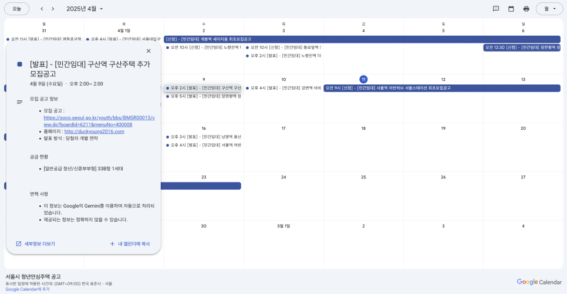

# 서울 청년안심주택 캘린더
* [서울시 청년안심주택](https://soco.seoul.go.kr/youth/bbs/BMSR00015/list.do?menuNo=400008) 공고를 구글 캘린더와 자동으로 동기화하는 프로그램입니다.

## 개요


### 캘린더 링크
* [Google Calendar](https://calendar.google.com/calendar/embed?src=13bd5bb3954acee3aae039b9adb95c876e6f4b6bdeeb713e913633577a3d3662%40group.calendar.google.com&ctz=Asia%2FSeoul)
  * 기존에 구글 캘린더를 사용하고 계신다면 위 링크를 클릭하여 구독(추가)할 수 있습니다.
* [iCalc Link](https://calendar.google.com/calendar/ical/13bd5bb3954acee3aae039b9adb95c876e6f4b6bdeeb713e913633577a3d3662%40group.calendar.google.com/public/basic.ics)
  * 다른 캘린더 애플리케이션에서는 위 링크를 이용해서 해당 캘린더를 추가할 수 있습니다.

## 실행 방법
* 원하는 분은 직접 실행해보실 수 있습니다.

### 사전 준비
* Node.js, npm, pnpm 필요

### 필요 파일
#### `.env` 파일
```text
TZ=Asia/Seoul
GEMINI_API_KEY=<GEMINI_API_KEY>
OWNER_GMAIL=<OWNER_GMAIL>
```
* `GEMINI_API_KEY`: [Gemini API Key](https://www.gemini.com/)를 발급받아 입력합니다. **(필수)**
* `OWNER_GMAIL`: 생성되는 구글 캘린더로 초대 받을 이메일을 입력합니다.
  * 입력하지 않아도 실행에 문제가 없습니다.
  * 입력한 경우, 해당 이메일은 생성되는 구글 캘린더의 소유자로 추가됩니다.
* 값을 입력할 때 꺽쇄 `<`와 `>`는 포함하지 않습니다.

#### `key.json` 파일
* 구글 캘린더 API 사용 및 인증을 위한 JSON 파일입니다.
* Google Cloud Platform에서 Service Account를 생성하고, JSON 파일을 다운로드하여 `key.json`으로 저장합니다.

### 빌드
```bash
pnpm install --frozen-lockfile
npx tsc
```

### 실행
```bash
node ./dist/index.js
```

### 데이터베이스 파일
* `./db.sqlite` 파일이 생성됩니다.
* 해당 파일이 없으면 자동으로 생성되고, 기존에 있는 경우에는 기존 데이터를 유지합니다.

## 구조
### 기술 스택
* Typescript, typeorm (sqlite)
* LLM (Gemini 2.0 Flash)

### 프로그램 흐름도
```text
프로그램 초기화 -> 업데이트 (모든 공고 로딩 -> 증분 업데이트)
```

#### 프로그램 초기화
1. DB 초기화
2. 캘린더 초기화
   1. 캘린더 생성 혹은 캘린더 조회
3. 캘린더 동기화
   1. 마지막 동기화 이후로 구글 캘린더에서 변경된 일정을 DB에 저장 (구글의 [증분 업데이트](https://developers.google.com/workspace/calendar/api/guides/sync) 참고)
   2. DB에 저장되어 있지 않은 캘린더 일정 삭제
   3. DB에 저장된 모집 공고를 캘린더 일정 추가

#### 업데이트
* 실행 직후(초기화 작업이 끝난 후) 및 0, 9, 12, 15, 18시에 자동으로 실행됩니다.

##### 모든 공고 로딩
1. 서울시 청년안심주택 공고 페이지에서 모든 공고를 크롤링 (첨부파일 포함)
2. 공고 내용 및 첨부파일의 해시를 비교하여 변경된 공고만 처리

##### 증분 업데이트
1. LLM으로 데이터 추출
   1. 공고 본문으로부터 신청 일정 및 당첨자 발표 일정을 추출
   2. 공고 첨부파일로부터 공급 규모, 당첨자 발표 방식 등을 추출
2. 일정 업데이트
   1. 해당 공고로 이전에 등록된 일정이 있으면 업데이트하고, 그렇지 않으면 새로 등록함.
3. 삭제된 글에 대한 일정 삭제
   1. DB에 있는 공고 중 크롤링하였을 때 공고가 존재하지 않는 것은 삭제된 글이므로 해당 일정을 삭제함.
